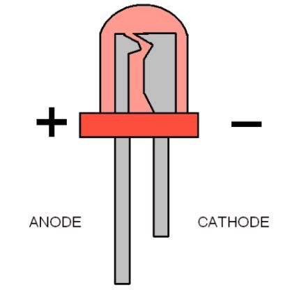
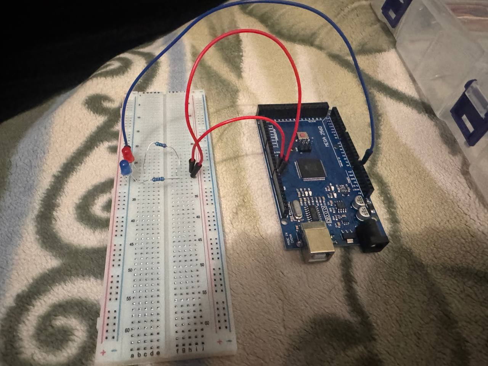

# Photos - Project Notes

This folder contains photos and wiring notes for the MiniPoliceLEDs project.

## Components
- Arduino Mega 2560
- Breadboard
- 2 × LEDs (red + blue)
- 2 × 220 Ω resistors
- 3 × male-to-male jumper wires

## How it works
The program simulates a mini police flashing light. Both LEDs repeatedly turn ON and OFF with a short delay. You can change the flashing speed by modifying the delay() value in the code.

## Wiring (clear step-by-step)
1. Connect Arduino GND to the breadboard power rail (-) using a blue jumper wire.
2. Place each LED on the breadboard so the anode (longer leg, +) is in a different row than the cathode (shorter leg, -).
3. 
4. Add a 220 Ω resistor in series with each LED anode (from the LED anode row to the row that will be connected to the Arduino pin).
5. Connect Arduino pin D8 to the red LED anode row (through its resistor) using a red jumper wire.
6. Connect Arduino pin D9 to the blue LED anode row (through its resistor) using a red jumper wire.
7. Connect both LED cathodes to the breadboard ground rail (-).
   

Notes:
- LED polarity: the longer leg is the anode (+), the shorter leg is the cathode (-).
- Always use current-limiting resistors (220 Ω recommended) to protect the LEDs.

### Your wiring text (verbatim)

GND Blue Jumper wire(Male to Male) connected to: – on the PowerRails of BreadBoard (PowerRails: 2 parts –and+)
- GND → BreadBoard Power Rail (-)
D9, D8, Red Jumper Wires(Male to Male) connected to:+ on the middle part of the BreadBoard Terminal Strips (Terminal Strips: 2 middle parts of BreadBoard)
- D8 → Red LED (through 220Ω resistor)
- D9 → Blue LED (through 220Ω resistor)
(LEDs, Having 2 legs, 1 is bigger is + (5V, HIGH) and –  (0V, LOW)

## What I learned
- Using digital output pins.
- Controlling LEDs with digitalWrite().
- Why current-limiting resistors are required.
- Organizing wiring on a breadboard.

## Possible improvements
- Add a buzzer.
- Control flashing speed with a potentiometer.
- Use PWM for smooth fade effects.
